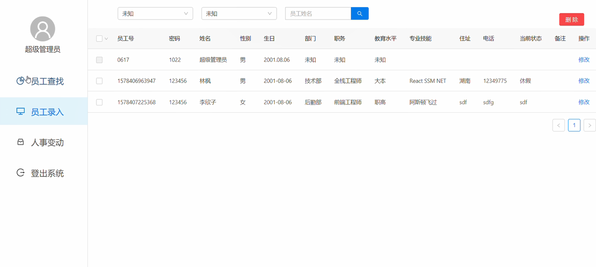

# Web课设

## 原项目

原项目使用的框架为

- React + Mobx + AntDesign + Axios
- SpringBoot + SpringMVC + Mybatis

- UI 设计使用 Axure8

## 预计改进

- 重构前端，修改为 Vue + Vuex + ElementUI + Axios    ~~（看心情改）~~
- 修改接口设计，使其更[RESTful](https://tonited.gitee.io/blog/2020/03/19/rest-jia-gou/)   ~~（懒得改）~~
- 后端调整项目结构，将其拆分成多个子项目，便于部署成[微服务](https://tonited.gitee.io/blog/tags/%E4%BB%80%E4%B9%88%E6%98%AF%E5%BE%AE%E6%9C%8D%E5%8A%A1%E6%9E%B6%E6%9E%84/)    ~~（也懒得改）~~

